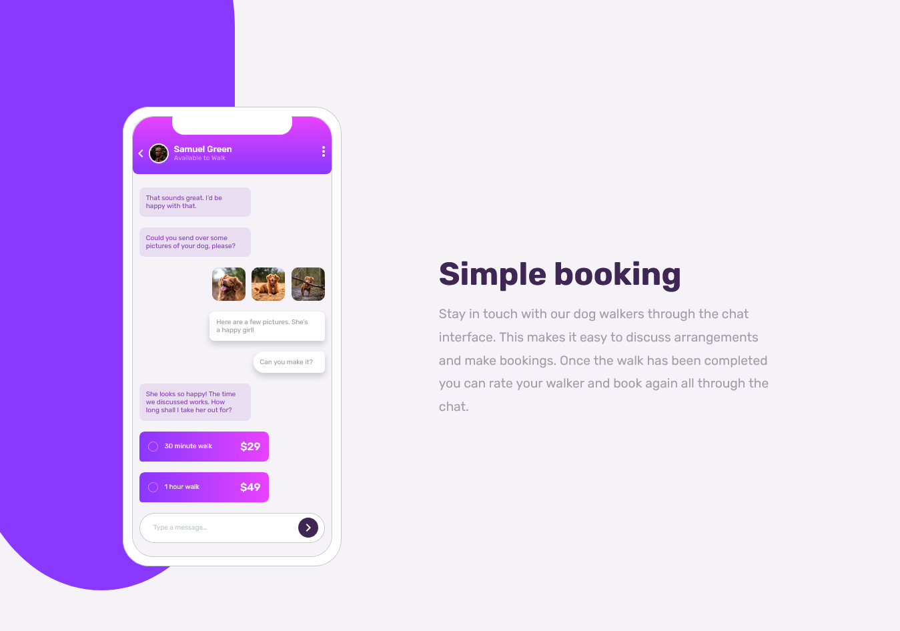

# Frontend Mentor - Chat app CSS illustration solution

This is a solution to the [Chat app CSS illustration challenge on Frontend Mentor](https://www.frontendmentor.io/challenges/chat-app-css-illustration-O5auMkFqY).

## Table of contents

- [Overview](#overview)
  - [Screenshot](#screenshot)
  - [Links](#links)
- [My process](#my-process)
  - [Built with](#built-with)  
  - [Useful resources](#useful-resources)
- [Author](#author)
- [Acknowledgments](#acknowledgments)

## Overview
 

### Screenshot

 

### Links

- Solution URL: [solution](https://github.com/KenawMarie/front-chat-app-css-illustration)
- Live Site URL: [Live site](front-chat-app-css-illustration/)

## My process

### Built with

- Semantic HTML5 markup
- CSS custom properties
- Flex box 
- CSS Positioning
- Pseudo elements

 
 

### Useful resources

- [Modern CSS:- Pure CSS Custom Styled Radio Buttons](https://moderncss.dev/pure-css-custom-styled-radio-buttons/) - This show me how to style radio buttons. 
 

## Author

- Website - [The Odin Project](https://www.theodinproject.com/dashboard)
- Frontend Mentor - [@kenawMarie](https://www.frontendmentor.io/profile/kenawMarie) 
 

## Acknowledgments

Thanks to the frontend mentor for this challenge.